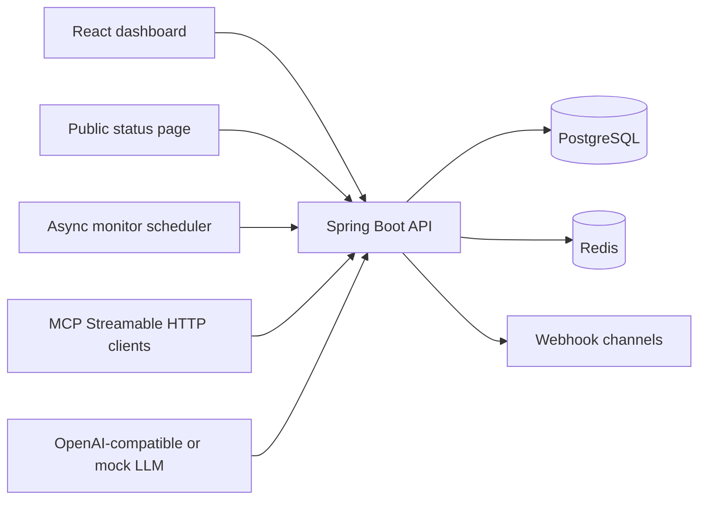

# API Sentinel

API Sentinel is a backend-focused API monitoring SaaS project built as a modular monolith: Spring Boot 3.5, PostgreSQL, scheduled health checks, incident automation, webhook alerts, public status pages, and a practical MCP/AI incident assistant. The frontend is a Vite + React + TypeScript control plane for the same APIs.

It is designed as a resume-grade backend project: the core value is in API design, persistence, scheduled workers, incident automation, authorization, metrics, and operational AI tooling rather than a landing-page UI.



## What Is Implemented

- JWT register/login/me flow with BCrypt password storage.
- Organization, project, and membership scoping.
- Monitor CRUD, manual checks, scheduled async checks, uptime/latency metrics.
- Incident auto-open/auto-resolve with timeline events.
- Webhook alert rules and notification channels.
- Privacy-safe public project status endpoint.
- API keys stored hashed and shown only once.
- MCP Streamable HTTP server with tools for health, incident history, latency stats, status-update drafts, and confirmed alert-rule creation.
- React dashboard, monitor detail, incidents, alerts, channels, public preview, AI assistant, and API key screens.

## Demo Flow

The fastest local demo uses the embedded H2 profile and any local HTTP app as the monitored target.

Example target used during development:

```text
http://localhost:5000/api/health
```

Demo sequence:

1. Register a user.
2. Create a monitor for the Express app health endpoint.
3. Run a successful check and show `UP`.
4. Stop the Express app.
5. Run three failed checks and show the monitor moving to `DOWN`.
6. Open the automatically created incident.
7. Restart the Express app and run a recovery check.
8. Show dashboard metrics, public status page, AI incident summary, and API key creation.

Full walkthrough: [docs/demo-script.md](docs/demo-script.md).

## Screenshots

Screenshots are intentionally not committed yet. Capture the working local demo and add them under `docs/screenshots/`.

Suggested captures are listed in [docs/screenshots.md](docs/screenshots.md).

## Backend Setup

Prerequisites: Java 17. Maven is not required globally because the backend includes wrapper scripts.

```powershell
cd E:\PROJECTS\api-sentinel
copy .env.example .env
docker compose up -d postgres redis
cd backend
.\mvnw.cmd spring-boot:run
```

Swagger UI is available at `http://localhost:8080/swagger-ui.html`.
Actuator health is available at `http://localhost:8080/actuator/health`.

### No-Docker Local Mode

If Docker or PostgreSQL is not installed, run the backend with the embedded H2 profile:

```powershell
cd E:\PROJECTS\api-sentinel\backend
.\mvnw.cmd spring-boot:run "-Dspring-boot.run.profiles=local"
```

This stores local data under `backend\data\api-sentinel.mv.db`. The H2 console is available at `http://localhost:8080/h2-console` with JDBC URL `jdbc:h2:file:./data/api-sentinel`, user `sa`, and an empty password.

## Frontend Setup

```powershell
cd E:\PROJECTS\api-sentinel\frontend
npm install
npm run dev
```

The Vite app defaults to `http://localhost:5173`.

## Environment Variables

The backend reads database, JWT, CORS, and AI settings from environment variables. For local development, `AI_PROVIDER=mock` returns deterministic incident-assistant responses without an external key. To use an OpenAI-compatible provider, set:

```text
AI_PROVIDER=openai
AI_OPENAI_BASE_URL=https://api.openai.com/v1
AI_OPENAI_API_KEY=...
AI_OPENAI_MODEL=gpt-4.1-mini
```

For Ollama-compatible local APIs, point `AI_OPENAI_BASE_URL` at `http://localhost:11434/v1` and set a local model name.

Production deployments should set:

```text
APP_URL=https://your-frontend-domain
CORS_ALLOWED_ORIGINS=https://your-frontend-domain
JWT_SECRET=at-least-32-random-characters
```

## Sample Webhook Payload

```json
{
  "project": {"id": "uuid", "name": "Production APIs"},
  "monitor": {"id": "uuid", "name": "Billing API", "state": "DOWN"},
  "incident": {"id": "uuid", "status": "OPEN"},
  "event": "MONITOR_DOWN",
  "timestamp": "2026-05-03T16:00:00Z",
  "dashboardUrl": "http://localhost:5173/monitors/uuid"
}
```

## MCP Tools

The Spring AI MCP server is configured for Streamable HTTP at `/mcp`.

- `get_monitor_health`
- `get_incident_history`
- `get_latency_stats`
- `summarize_recent_incidents`
- `draft_status_update`
- `create_alert_rule`

Tools require an API key parameter. Configuration-changing tools require `confirmed=true`.

## Resume Bullets

- Built a Spring Boot API monitoring platform with async scheduled health checks, PostgreSQL persistence, incident automation, and webhook delivery audit trails.
- Implemented secure JWT authentication, organization-scoped authorization, BCrypt credentials, and hashed one-time API keys.
- Exposed a Spring AI MCP Streamable HTTP server with tool-level authorization for incident analytics and operational workflows.
- Created a React/TanStack Query dashboard with uptime, p95 latency, incidents, alert rules, public status preview, and an AI incident assistant confirmation flow.

## Deployment

Recommended simple deployment:

```text
Frontend: Vercel
Backend: Render/Railway/Fly.io
Database: managed PostgreSQL
```

Deployment files included:

- `backend/Dockerfile`
- `frontend/vercel.json`
- `render.yaml.example`
- `frontend/.env.production.example`

Detailed guide: [docs/deployment.md](docs/deployment.md).

## Testing

Backend tests:

```powershell
cd backend
.\mvnw.cmd test
```

Frontend checks:

```powershell
cd frontend
npm run typecheck
npm run build
```
